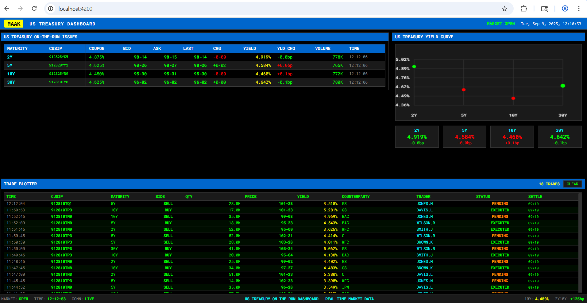

# US Treasury Dashboard

A real-time dashboard for monitoring US Treasury on-the-run issues with Bloomberg terminal-inspired styling.

## Features

- **Real-time Market Data**: Live updates of treasury bond prices, yields, and changes
- **Bloomberg Terminal Styling**: Dark theme with green/red color coding for market movements
- **WebSocket Integration**: Real-time data streaming between backend and frontend
- **Yield Curve Visualization**: Interactive chart showing the current yield curve
- **On-the-Run Issues**: Tracks 2Y, 5Y, 10Y, and 30Y treasury bonds
- **Market Data Grid**: Comprehensive view of CUSIP, prices, yields, volume, and changes

## Technology Stack

### Backend
- **Java 17** with **Spring Boot 3.2.0**
- **Spring WebSocket** for real-time data streaming
- **H2 Database** for in-memory data storage
- **Maven** for dependency management

### Frontend
- **Angular 17** with standalone components
- **TypeScript** for type safety
- **SCSS** for Bloomberg-inspired styling
- **WebSocket (STOMP)** for real-time updates
- **Canvas API** for yield curve charting

## Project Structure

```
MAAK-TreasuryDashboard/
├── backend/                 # Spring Boot backend
│   ├── src/main/java/
│   │   └── com/maak/treasurydashboard/
│   │       ├── config/      # WebSocket & CORS configuration
│   │       ├── controller/  # REST API controllers
│   │       ├── model/       # JPA entities
│   │       ├── repository/  # Data repositories
│   │       └── service/     # Business logic & data simulation
│   └── pom.xml
└── frontend/                # Angular frontend
    ├── src/
    │   ├── app/
    │   │   ├── components/  # UI components
    │   │   ├── models/      # TypeScript interfaces
    │   │   └── services/    # HTTP & WebSocket services
    │   └── styles.scss      # Bloomberg terminal styling
    └── package.json
```

## Setup Instructions

### Prerequisites
- Java 17 or higher
- Node.js 18 or higher
- Maven 3.6 or higher
- Angular CLI (optional, for development)

### Backend Setup

1. Navigate to the backend directory:
   ```bash
   cd backend
   ```

2. Install dependencies and run:
   ```bash
   mvn clean install
   mvn spring-boot:run
   ```

3. The backend will start on `http://localhost:8080`

### Frontend Setup

1. Navigate to the frontend directory:
   ```bash
   cd frontend
   ```

2. Install dependencies:
   ```bash
   npm install
   ```

3. Start the development server:
   ```bash
   npm start
   ```

4. The frontend will be available at `http://localhost:4200`

## API Endpoints

- `GET /api/treasury/bonds` - Get all treasury bonds
- `GET /api/treasury/bonds/{cusip}` - Get specific bond by CUSIP
- `POST /api/treasury/initialize` - Initialize sample data
- `WebSocket /ws` - Real-time market data updates

## Features Overview

### Market Data Grid
- Real-time updates with visual indicators (blinking on changes)
- Color-coded price and yield changes (green for positive, red for negative)
- Bond pricing in 32nds format (traditional treasury format)
- Volume display with K/M suffixes
- Bid/Ask spreads

### Yield Curve Chart
- Canvas-based visualization of the current yield curve
- Real-time updates with color-coded data points
- Grid lines for easy reading
- Basis point change indicators

### Bloomberg Terminal Styling
- Dark background with green text (classic terminal look)
- Monospace fonts for data alignment
- Color coding: Green (positive), Red (negative), Yellow (neutral)
- Blinking animations for real-time updates
- Professional financial data presentation

### Status Bar
- Market status indicator
- Real-time clock
- Connection status
- Key market metrics (10Y yield, 2Y-10Y spread)

## Data Simulation

The application includes a realistic market data simulator that:
- Updates bond prices every 2 seconds
- Generates realistic price movements using Gaussian distribution
- Maintains proper bid/ask spreads
- Simulates trading volume
- Calculates yield changes based on price movements

## Development Notes

- The backend uses H2 in-memory database for simplicity
- WebSocket connections auto-reconnect on failure
- All timestamps are in local time
- Price changes are calculated in 32nds (traditional bond format)
- Yield changes are displayed in basis points (bp)

## Customization

To modify the update frequency, change the `@Scheduled(fixedRate = 2000)` annotation in `TreasuryDataService.java`.

To add more treasury maturities, update the initialization data in `TreasuryDataService.initializeData()` method.

## Browser Compatibility

- Chrome 90+
- Firefox 88+
- Safari 14+
- Edge 90+
